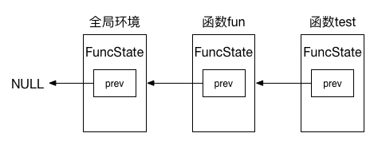
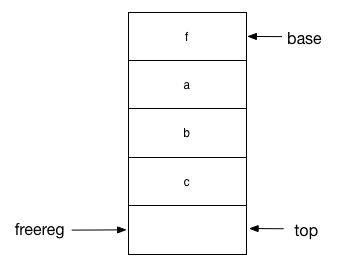

##函数相关操作指令
接着下来看函数相关的指令。首先考虑一下，与函数相关的操作有哪些，需要哪些数据结构来管理这些操作相关的信息：

1.  独立的函数环境，函数体内部定义的局部变量都是局限这个环境的。
2.  函数的参数，也被认为是这个函数体内的局部变量。
3.  函数调用前，要保护好调用者的环境，而在函数调用完毕之后，要准确的恢复调用者之前的环境，并且如果存在返回值的话，也要正确处理。

下面，带着这几个问题，开始讨论函数相关的操作。

首先来看Lua解释器中哪个数据结构负责来保存函数的信息，在代码中这部分信息保存在FuncState结构体中，里面的数据后面会展开来讨论，毕竟这是一个很重要的数据结构：

*   Proto *f：保存函数体相关指令的结构体数组，在函数体内部存在的所有函数，在解析完毕生成Proto信息之后都会存放在这里。
*   Table *h：
*   struct FuncState *prev：父函数的FuncState指针。
*   struct LexState *ls：保存词法状态的数据。
*   struct lua_State *L：Lua虚拟机指针。
*   struct BlockCnt *bl：存放函数内block的指针。
*   int pc：
*   int lasttarget：

这里首先需要专门解释一下，什么叫做父函数的FuncState指针，即前面数据成员中的prev是什么含义。

比如以下代码:

```Lua
function fun()
    local a = 2
    function test()
        local a = 1
    end
end
```

在上面的代码中，函数test对应的FuncState指针的prev成员，就指向它的父函数fun的FuncState地址。回想起前面提到的查找一个变量所在函数的singlevaraux，就是根据这个prev指针，顺藤摸瓜的一直往上层来查找变量的。同时，这个过程也解释了一个现象，即当前函数站的局部变量，会覆盖上层函数的使用，在上面的例子中，函数test中对局部变量a赋值为1的动作，并不会影响其父函数fun中的局部变量a。

前面的数据成员中，提到了有一个Proto *f的成员，负责保存函数体解析完毕之后生成的指令的数据。那么，如果一个Lua代码中，没有任何一个涉及函数定义的部分，解析这些Lua代码生成的指令将会存放在哪里呢？答案还是存放在Proto结构体中。这里需要确立一个概念，一个Lua文件，本身就对应一个FuncState结构，以前面给出的例子来说明就是这样的：



以上解释了成员prev指针的作用：它指向本函数环境的父函数的FuncState指针。

结合前面提到的singlevaraux函数，给出它查找变量的伪算法如下：

1.  如果当前调用参数的FuncState为空，说明已经在该文件的全局环境中都查不到这个变量，那么就是全局变量，返回VGLOBAL；
2.  否则调用函数searchvar在当前层次查找变量，如果找到了那么认为是局部变量，返回VLOCAL；
3.  以上两种情况都不是，那么递归调用函数singlevaraux在父函数中查找，此时传入singlevaraux函数的FuncState指针为当前指针的prev指针，如果返回VGLOBAL仍然认为是全局变量，否则如果那么认为是UpValue，返回VUPVAL。

接下来解释FuncState结构体中的Proto *f信息是如何保存的。

前面提到过，函数luaY_parser是整个Lua分析的入口函数，这个函数的返回结果就是一个Proto指针，换句话说，Proto结构体就是Lua语法分析之后的最终产物，而其它在这个过程中看到的数据结构，比如这里看到的FuncState，LexState结构体，都是为了语法分析的临时数据结构而已。

回到这里谈到的问题，从前面的结论可以推断出来：一个在某个环境下定义的函数，解析这个函数体之后的Proto信息，必然也是存放在该环境下的Proto结构体中，最后一并返回的。来看看在Lua代码中是如何做到这一点的。

当开始处理一个函数的定义时，首先调用open_func函数，创建一个新的Proto结构体用于保存函数原型信息，接着将该函数的FuncState的prev指针指向父函数。最后当函数处理完毕时,调用pushclosure函数将这个新的函数的Proto结构体push到父函数的Proto数组中。

解析一个函数体的信息，对应的在函数body中，这里只截取重要的部分，代码如下：

```C
(lparser.c)
576 static void body (LexState *ls, expdesc *e, int needself, int line) {
577   /* body ->  `(' parlist `)' chunk END */
578   FuncState new_fs;
579   open_func(ls, &new_fs);
580   new_fs.f->linedefined = line;
581   checknext(ls, '(');
582   if (needself) {
583     new_localvarliteral(ls, "self", 0);
584     adjustlocalvars(ls, 1);
585   }
586   parlist(ls);
587   checknext(ls, ')');
588   chunk(ls);
589   new_fs.f->lastlinedefined = ls->linenumber;
590   check_match(ls, TK_END, TK_FUNCTION, line);
591   close_func(ls);
592   pushclosure(ls, &new_fs, e);
593 }
```

这里做的工作是：

1.  579行，调用open_func函数：主要做的就是初始化FuncState的工作，前面提到过，FuncState的成员prev指针指向其所在的父函数的FuncState指针，就是在这里完成的.另外，这里还创建了分析完毕的生成物Proto指针，只不过此时该Proto指针隶属于FuncState，因此为了避免被GC回收，在创建完毕之后会将Proto指针和保存常量的Table压入该函数的栈中。因此无论如何，当分析一个函数的时候,其栈底最开始的两个位置都是留给这两个变量的。
2.  581-590行，具体完成函数体的解析，解析结果作为结果保存在这里的局部变量new_fs的Proto *f中了。
3.  591行，分析完毕之后调用close_func函数，用于将最后分析的结果保存到Proto结构体中。在FuncState中有许多与Proto相类似的变量，比如FuncState中的nk存放的是常量数组(也就是k数组)的元素数量，而Proto中的sizek也是这个涵义，那么为什么需要把同样涵义的变量在两个不同的结构体中分别用不同的变量来保存呢？答案是在分析过程中,FuncState.nk是不停的在变化的，而Proto.sizek直到分析完毕调用close_func时才将FuncState.nk赋值给它。可以看到,FuncState是分析过程中使用的临时结构体，最终都是要为Proto服务的。close_func还做的操作就是通过open_func中的保存的prev指针还原，以及将栈指针减二,不再保存Proto指针和常量Table在栈中。
4.  592行，调用pushclosure函数。此时已经分析完毕一个函数，已经有了分析的成果Proto结构体，该成果保存在new_fs的Proto成员中,此时LexState中的FuncState已经在前面调用close_func时中还原为父函数的FuncState，此时调用pushclosure操作，做的工作主要就是把new_fs的Proto指针保存到父函数FuncState的Proto指针的p数组中。除此之外，这个函数内部还会生成引用外部变量所需要的MOVE和GET_UPVAL指令，这一点在后面会描述。


最后，由于函数在Lua中是所谓的”first class type”，所以其实以下两段Lua代码是等价的:

```Lua
function test()
end

test = function ()
end
```

生成一段代码，用于保存函数test的相关信息，之后再将这些信息赋值给变量test，这里的test可以是local，也可以是global的，这一点跟一般的变量无异。

有了前面的准备，可以开始分析函数的定义相关的内容了。

首先来看一个最简单的函数定义：

```
function test()
end
```

这段代码定义了一个最简单的无参数的函数test，使用ChunkSpy反编译出来的指令是：
```
; function [0] definition (level 1)
; 0 upvalues, 0 params, 2 stacks
.function  0 0 2 2
.const  "test"  ; 0

; function [0] definition (level 2)
; 0 upvalues, 0 params, 2 stacks
.function  0 0 0 2
; (2)  end
[1] return     0   1
; end of function

[1] closure    0   0        ; 0 upvalues
; (1)  function test()
[2] setglobal  0   0        ; test
; (2)  end
[3] return     0   1
; end of function
```

从这里看出，整个代码分为两层，第二层就是函数test，而第一层函数即全局环境，这一层第一条指令是一个closure语句用于定义一个函数，紧跟着是一条setglobal指令，用于将函数体的信息赋值给全局变量"test"，这就完成了函数test的定义。

与函数定义相关的指令OP_CLOSURE格式如下：

```
OP_CLOSURE,/* A Bx  R(A) := closure(KPROTO[Bx], R(A), ... ,R(A+n))  */
```

OPCODE        | 作用
------------- |-----:
OP_CLOSURE| 定义一个函数

参数        | 说明
--- | -----:
参数A | 存放函数的寄存器
参数B | Proto数组的索引
参数C | 无

与这部分代码相关的EBNF：

```
chunk -> { stat [`;'] }
stat -> funcstat
funcstat -> FUNCTION funcname body
```

所以这里的核心就是funcstat函数和body函数，body处理函数体的解析，funcstate处理函数的定义，即如何把函数体信息和变量结合在一起，。

先来看funcstat函数：

```C
1212 static void funcstat (LexState *ls, int line) {
1213   /* funcstat -> FUNCTION funcname body */
1214   int needself;
1215   expdesc v, b;
1216   luaX_next(ls);  /* skip FUNCTION */
1217   needself = funcname(ls, &v);
1218   body(ls, &b, needself, line);
1219   luaK_storevar(ls->fs, &v, &b);
1220   luaK_fixline(ls->fs, line);  /* definition `happens' in the first line */
1221 }
```

这里做的主要工作是：
1.  定义存放表达式信息的变量v、b，其中v用来保存函数名信息，b用来保存函数体信息。
2.  调用funcname函数解析函数名，结果保存在变量v中。
3.  调用body函数解析函数体，返回的信息存放在b中。
4.  调用luaK_storevar将前面解析出来的body信息与函数名v对应上。

luaK_storevar函数这里不展开讨论了，其实就是根据变量不同的作用域来生成保存变量的语句，在这里的例子中，函数test是全局的，所以最后这里会生成一个OP_SETGLOBAL语句。

接下来看body函数，前面已经做过分析，但是前面的分析中，并没有涉及到函数体内变量引用的问题，以这个问题为源头，来看看下面这段Lua代码：

```
local g = 2

function fun()
  local a = 1
  function test()
    a = g
  end
end
```

在函数test中，一共引用了两个变量，其中局部变量a与函数test在同一层，而局部变量g比函数test更高一层，来看看Lua解释器是如何处理这部分内容的。
前面提到，函数pushclosure中会生成引用外部变量的MOVE和GET_UPVAL指令，来看这个函数的代码：

```C
310 static void pushclosure (LexState *ls, FuncState *func, expdesc *v) {
311   FuncState *fs = ls->fs;
312   Proto *f = fs->f;
313   int oldsize = f->sizep;
314   int i;
315   luaM_growvector(ls->L, f->p, fs->np, f->sizep, Proto *,
316                   MAXARG_Bx, "constant table overflow");
317   while (oldsize < f->sizep) f->p[oldsize++] = NULL;
318   f->p[fs->np++] = func->f;
319   luaC_objbarrier(ls->L, f, func->f);
320   init_exp(v, VRELOCABLE, luaK_codeABx(fs, OP_CLOSURE, 0, fs->np-1));
321   for (i=0; i<func->f->nups; i++) {
322     OpCode o = (func->upvalues[i].k == VLOCAL) ? OP_MOVE : OP_GETUPVAL;
323     luaK_codeABC(fs, o, 0, func->upvalues[i].info, 0);
324   }
325 }
```
这部分代码的功能是：
1.  311-318：将解析函数体生成的Proto指针赋值到父函数FuncState的Proto数组中。
2.  320：生成一个OP_CLOSURE指令，前面提到过函数在Lua中是一个"first type"的数据，因此在这里的类型同样是需要重定向的，因为后面需要将这个函数体与具体的变量进行一个绑定，而此时并不知道对应的寄存器地址是多少。
3.  321-324：根据引用的外部变量是同一层的局部变量与否，来生成MOVE或者GET_UPVAL指令，这部分代码的作用就是将这些外部引用的对象赋值到当前函数栈中。

接下来看看如何处理函数的参数，把前面的例子做一下修改：

```Lua
function f(a, b, c)
end
```

这个函数体对应的ChunkSpy反编译的指令是：

```
; function [0] definition (level 2)
; 0 upvalues, 3 params, 3 stacks
.function  0 3 0 3
.local  "a"  ; 0
.local  "b"  ; 1
.local  "c"  ; 2
; (2)  end
[1] return     0   1
; end of function
```

可以看到，这对这个函数的三个参数a、b、c，有三个同名的局部变量与之对应。因此在进入这个函数时，其对应的栈空间是这样的：



解析函数参数对应的操作在函数parlist中，它的EBNF语法是：

```
parlist -> [ param { `,' param } ]
```

因此这个函数主要的操作，其实很容易能够想到：

1.  当当前解析的字符没有遇到“)”时，继续往下解析参数。
2.  针对解析到的每一个参数，生成一个与之对应的局部变量。
3.  解析完毕之后，根据参数个数调整函数体内局部变量的数量。

注意在这部分的解释中，并没有解释函数参数如何处理可变参数的情况，

接下来看调用函数的流程。

调用一个函数有以下三种格式，也就是对应前面词法部分提到的funcargs非终结符有三个子节点：

1.  使用括号围起来的表达式列表，如print("a")。
2.  不使用括号围起来的字符串，如print "a"。
3.  参数为一个表，如print{["a"]=1}。
简单起见，在这里只解释第一种最简单最常见的情况，剩下两种情况其实也差不多，不在这里阐述了。

调用一个函数，走过的EBNF路径是这样的：

```
chunk -> { stat [`;'] }
stat -> exprstat
exprstat -> primaryexp
primaryexp -> prefixexp funcargs
```

可以想见，调用一个函数时，需要先做如下的准备工作：
1.  找到函数在哪里，先加载进来才可以在后面进行调用。
2.  准备好函数的参数，按照前面分析的那样，将函数参数加载到函数栈空间中。

实际上也确实是这样的，来看一个最简单的函数调用代码：

```
print("a")
```

将代码反编译出来的指令是：

```
; function [0] definition (level 1)
; 0 upvalues, 0 params, 2 stacks
.function  0 0 2 2
.const  "print"  ; 0
.const  "a"  ; 1
; (1)  print("a")
[1] getglobal  0   0        ; print
[2] loadk      1   1        ; "a"
[3] call       0   2   1
[4] return     0   1
; end of function
```

它做了几件事情：
1.  getglobal指令用于加载全局变量“print”函数，这一步用于查找函数名对应的变量的。前面提到过，函数在Lua中与一般的变量其实没有太大的区别，所以这里也可能是其他类型的加载变量的指令，这取决于在哪个作用域中查找到这个函数。
2.  loadk指令用于加载常量“a”，同样的，这里根据参数的作用区域也可能是其他的加载数据相关的指令。
3.  最后就是call指令用于调用函数了。

```
OP_CALL,/*  A B C R(A), ... ,R(A+C-2) := R(A)(R(A+1), ... ,R(A+B-1)) */
```

OPCODE        | 作用
------------- |-----:
OP_CALL| 调用函数，同时返回值

参数        | 说明
------------- |-----:
参数A | 创建好的表存入寄存器的索引
参数B | 表的数组部分大小
参数C | 表的hash部分大小


```
; function [0] definition (level 1)
; 0 upvalues, 0 params, 2 stacks
.function  0 0 2 2
[1] return     0   1
; end of function
```

